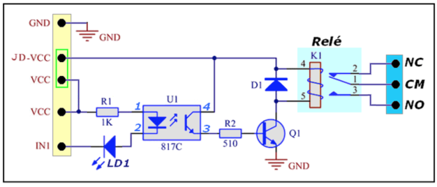

<td style="width: 20%;"></td>

<strong> Jump JD-VCC</strong>

<strong>Prof Epaminondas Lage</strong>

<a href="http://lattes.cnpq.br/7787341723868111"> Currículo Lattes LAGE, E. S.</a> 

<td style="width: 15%;"></td>

# Índice 

* [Introdução](#Introdução)
* [Módulo Relé com apenas 1 canal](#Módulo-Relé-com-apenas-1-canal)
* [JD-VCC não conectado ao VCC](#JD-VCC-não-conectado-ao-VCC)
* [JD-VCC conectado ao VCC](#JD-VCC-conectado-ao-VCC)
* [Módulo Relé com 8 canais"](#Módulo-Relé-com-8-canais")
* [Referência](#Referência)

# Introdução

# Módulo Relé com apenas "1 canal"

Na figura,  vc pode observar que a sequência dos sinais no Circuito, foi alterada. A sequência dos pinos está ao lado da "foto" do módulo Relé,  sendo os pinos numerados de 1 a 5.  Mas esta numeração não é importante. O importante são os sinais em si, e no Circuito eu alterei esta sequência apenas para para facilitar o entendimento do funcionamento.

Vamos considerar 2 cenários: um onde o "JD-VCC" não está conectado ao "VCC", e um onde o "JD-VCC" está conectado ao "VCC" (via "jumper" encaixado nos dois terminais no conector). Então segue:

# "JD-VCC" não conectado ao "VCC"

Se vc seguir o circuito iniciando pelo sinal "VCC", passando pelo Resistor R1, depois pelo LED interno do Opto-Acoplador (terminais 1 e 2 de U1), e finalmente pelo LED "LD1", então se chega ao sinal "IN1".  Agora esqueça o restante do circuito, e se concentre nesse "caminho" que eu descrevi.

Se vc ligar o sinal "VCC" ao 5V do Arduino, e o sinal "IN1" a um pino de saída do Arduino,  então tanto o LED do Opto-Acoplador, como o LED LD1 serão acionados quando se tem "LOW" no sinal "IN1",  e caso tenhamos "HIGH" em "IN1" então ambos os LEDs ficarão desacionados.  Assim dizemos que o acionamento é através do Nivel "LOW" (ou "0" se preferir).

Agora considere ligar o sinal "VCC" a um pino de saída do Arduino,  e o sinal "IN1" ao  GND do Arduino (NÃO é o GND da plaquinha do Relé!!!).  Nesta condição, para que os LEDs sejam acionados,  é necessário que tenhamos "HIGH" na saída do Arduino,  e caso tenhamos "LOW" os LEDs estarão desacionados.

Conclusão
O sinal "VCC" é apenas o nome que deram ao sinal, mas de fato vc deve encará-lo apenas como o sinal que está ligado (via R1) ao "Anodo" do Opto-Acoplador (terminal 1 de U1).  Assim, para que os LEDs sejam acionados,  é preciso que este terminal tenha uma tensão elétrica positiva em relação ao sinal "IN1".  Logo, se vc fixa o sinal "VCC"  em 5V (do Arduino), então obrigatoriamente para acionar os LEDs,  "IN1" deverá ser "LOW".  Já se vc fixa o sinal "VCC" em 0V (o GND do Arduino), obrigatoriamente para acionar os LEDs "IN1" deverá ser "HIGH". Não tem outra forma.

Então observe, que vc pode escolher qual será o Nível Lógico ("LOW" ou "HIGH") que acionará o circuito, o que é portanto 100% flexível em relação a esta escolha do Nivel Lógico.  E claro:  o sinal "VCC" na plaquinha é apenas o nome que deram, e não significa que vc deve ligá-lo ao VCC do Arduino (5V). Obviamente, a escolha do nome "VCC" para o sinal, não foi muito feliz.

Mas há ainda outra questão:  a isolação.  Observe que o "caminho" do circuito que descrevi, em nenhum momento entra em contato elétrico com os demais sinais do Circuito, ou melhor:  em nenhum momento aquele "caminho" entra em contato com o restante do Circuito que aciona diretamente a Bobina do Relé (R2, Q1, D1). Então dizemos que um circuito está isolado eletricamente do outro. Claro que existem distâncias físicas entre os componentes na plaquinha, e algumas são bem pequenas, talvez até menos de 1mm (isto irá variar de placa pra placa, já que existem muitos modelos no mercado).  Os circuitos estão efetivamente isolados, mas o quanto é "forte" esta isolação, vai depender destas distâncias. Por exemplo: se vc aplicar entre os dois circuitos (pode ser entre quaisquer dois pontos entre os dois) uma tensão de 1000V (mil Volts),  e a menor distância for de 1mm,  provavelmente a isolação irá aguentar, mas se vc aplicar 2500V então poderá começar a "pular" faíscas elétricas entre os dois pontos (da mesma forma que pulam na "cabeça" da vela em um motor de carro).  Este assunto é um tanto denso, e estou olhando pelo lado mais simples,  pois na prática, a isolação dependerá de diversas características, como o material existente entre os dois pontos (no exemplo são dois: o material da placa e o "Ar"), e ainda existem variações a considerar na medição das distâncias (chamadas de "clearance").

Mas o que interessa aqui é que nas condições que descrevi para as ligações, existe isolação entre os circuitos de acionamento dos LEDs, e o restante do circuito que aciona a Bobina do Relé (D1, Q1, R2,  e o transistor interno do Opto-Acoplador).

Claro, para que efetivamente o Relé seja acionado (quando vc acionar os LEDs) ,  vc precisa aplicar uma tensão entre o sinal "JD-VCC"  e o sinal "GND", e esta tensão é a "nominal" para a Bobina do Relé.  Ou seja, aplique a tensão entre "JD-VCC" e o "GND",  e controle o "ON/OFF" do Relé através de um circuito isolado acionado pelo Arduino.

Logo, podemos completar a conclusão nesta "configuração":  podemos escolher o Nivel Lógico que acionará o Relé, e ainda temos isolação elétrica entre o circuito do Relé e o Arduino.  No entanto note que precisamos de uma Fonte "separada" para alimentarmos a Bobina do relé, e a tensão dessa Fonte será a mesma da Bobina do Relé, o que nos permite usar Relés com diferentes tensões da Bobina (sem estar limitado aos 5V do Arduino).

# "JD-VCC" conectado ao "VCC"

A primeira implicação óbvia, é que automaticamente já não temos mais a isolação elétrica entre os dois circuitos.  A segunda, é que a tensão elétrica do sinal "VCC" será a mesma do sinal "JD-VCC".  Mas como vimos, para acionarmos a Bobina do Relé, a tensão em "JD-VCC" deve ser em relação ao sinal "GND" da plaquinha. Então por uma questão de simplificar o controle,  é conveniente que o sinal "GND" seja também conectado ao "GND" do Arduino, pois assim  tanto o "VCC" (que está agora ligado ao "JD-VCC") como o "IN1"  terão como referência uma mesma tensão (o GND do Arduino).  E se a Bobina do Relé for de 5V,  então parece conveniente também ligar o "VCC/JD-VCC" ao 5V do Arduino.  E por consequência, obrigatoriamente o "IN1" deverá ser "LOW" para acionar o Relé (como vimos no item "1"), e não há outra possibilidade, uma vez que o "VCC" está ligado ao "JD-VCC" e este último tem que ser a alimentação "positiva" para a Bobina do Relé.

Conclusão: além de perdermos a isolação entre os dois Circuitos (Arduino e acionamento da Bobina do Relé),  também não temos escolha em relação do Nível Lógico que liga o Relé, que agora deve ser obrigatoriamente "LOW".  Qual a vantagem então?  apenas uma:  vc não precisa de uma Fonte "separada" para acionar a Bobina do relé,  pois está aproveitando o 5V do Arduino para fazer isso, mas claro que agora também terá obrigatoriamente que usar Relés com Bobina de 5V (mas isto pode ser contornado se vc ao invés de ligar o "IN1" ao Arduino, usar um Transistor entre o Arduino e o "IN1").

E claro:  a corrente "puxada" pela Bobina do Relé,  será drenada do 5V do Arduino.  Para a maioria dos Relés de 5V nas plaquinas,  essa corrente é tipicamente de 70mA,  ou seja: é significativa, e se vc tem daqueles módulos com dois Relés ou mais,  cada Bobina irá puxar esta corrente do 5V do Arduino.  Para um módulo com 4 Relés,  a corrente "puxada" será 4x70mA = 280mA.

Devido a essa corrente "alta" para módulos com vários Relés,  é comum que o "pessoal" use uma Fonte  externa para o 5V do Arduino. Essa fonte alimentará o 5V do Arduino diretamente, e proverá a corrente necessária para as Bobinas dos diversos Relés no Sistema. Mas existe um problema que precisa ser considerado:  não temos mais a isolação entre o Arduino e os circuitos da Bobina do Relé.  Ok, mas qual o problema disso?   Veja:  devido à forma física como o Relé é construído,  existe fácil acoplamento magnético entre a Bobina e os Contatos do Relé (óbvio né, afinal é o campo magnético da Bobina que fecha os Contatos do Relé). Assim, se algum "spike" de tensão ou corrente ocorre entre os contatos do Relé, devido ao acoplamento magnético  estes "spikes" também induzem tensão nos terminais da Bobina, chegando portanto ao Arduino (já que agora não mais existe mais a isolação). Na maioria das vezes estes skipes não chegam a serem fortes o suficiente para danificar os circuitos do Arduino (embora isso seja possível),  mas são fortes o suficiente para alterar Níveis Lógicos "estáticos" nos pinos do Arduino (não entrarei em detalhe de como ocorre isso, porque é muito técnico e exige muitos detalhes em conhecimento de circuitos de comutação). Então é comum que os próprios pinos do Arduino que acionam os Relés, mudem de estado, gerando acionamentos/desligamentos imprevistos dos Relés. Inclusive se o "spike" ocorre em um Relé, pode afetar qualquer outro pino do Arduino mesmo que este pino não seja usado para o controle de um Relé.  Pode ser tão "bravo", que o próprio Processador do Arduino "se perde" na execução do código, sendo comum inclusive que sofra um Reset.

Devido às possibilidades de configuração da plaquinha do Relé,  existem também uma série de outras consequências, mas não vou adentrar para não demorar mais no texto.

# Módulo Relé com 8 canais

acho que vc já percebeu que o Fabricante fixou definitivamente o "JD-VCC"  ao "VCC". Logo,  a primeira consequência disto é que não há mais isolação entre o Arduino e os circuitos das Bobinas dos Relés. E porque isto foi feito?   Ocorre que a maioria esmagadora das pessoas usa esses módulos de Relés com o "JD-VCC" sempre conectado ao "VCC" (ou seja, sem isolação),  e por isso o Fabricante tomou a decisão de fazer essa conexão permanente no traçado do circuito.  Claro, devido a esta falta da isolação,  vc precisa ficar atento aos "spikes" que possam ocorrer nos contatos do Relé. Sobre isto, pesquise sobre "Snubbers" que são circuitos simples usados para minimizar a intensidade e portanto o efeito dos "spikes" (e assim impedir os problemas que descrevi sobre estes).

Mas vc deve se lembrar que quando o "JD-VCC" é conectado ao "VCC", não temos a opção de escolher o Nível Lógico que aciona os Relés.  Ocorre que pra não perder esse "feature",  o Fabricante da placa mudou ligeiramente o circuito que aciona o LED do Opto-Acoplador,  de uma forma que agora vc consegue selecionar para cada Relé,  qual o Nível Lógico de acionamento. E isto é feito naqueles pontos com "jumpers" selecionando "HIGH" ou "LOW", existentes na Placa. Apenas isso.  Assim respondendo à sua última pergunta:  isto não tem  relação com "sobrecarga" no Arduino.  É apenas uma seleção da lógica de acionamento.

E porque só existe o "DC+" e o "DC-" ?   Simples:  o "DC+"  é o "JD-VCC" permanentemente conectado ao "VCC",  e o "DC-" é o "GND" que existia na plaquinha que eu descrevi.  Então obviamente, é obrigatório para esta placa que este "DC-" esteja ligado ao GND do Arduino.  Mas existe um "truque" aqui:  se vc tiver uma fonte de 5V alimentando diretamente o Arduino, pode minimizar os problemas de "spike",  ligando o "DC+" com um fio indo diretamente ao 5V da Fonte (ou seja: sem "puxar" esta ligação da placa do Arduino). E para o "DC-"  dois fios  devem ser ligados:  um indo diretamente ao GND da Fonte (igual feito para o "DC+", e com a mesma bitola deste),  e um segundo fio (este pode ser mais fino)  ligado entre o "DC-" e o GND do Arduino. Veja: isso não elimina os "spikes", mas minimiza os efeitos destes.

Como vc deve imaginar pelas explanações que postei aqui,  o que vc descreveu sobre o comportamento ON/OFF  da sua placa de 8 Relés,  é absolutamente o que seria esperado.

Bem não entendi o que vc quis dizer sobre "ponte". Posso tentar imaginar que seria ligar direto com fio (sem usar os "jumpers") para fazer a seleção "HIGH" ou "LOW" para cada Rele.  Mas não sei se é isto que vc quis dizer.  Se for isso,  então vc pode sim fazer a tal "ponte".

Mas talvez vc esteja se referindo a uma "ponte de relés" para acionar Motores, para controle ON/OFF e da direção da rotação.  Se for isso,  vc pode também fazer sem problemas (mas não se esqueça de pesquisar sobre os "Snubbers", pois pode precisar deles).

## Referência

* https://labdegaragem.com/forum/topics/m-dulo-rel-8-canais-sem-jd-vcc-vcc-gnd
* https://blog.multcomercial.com.br/o-que-e-um-rele-quais-suas-funcoes-aplicacoes/
* https://www.filipeflop.com/blog/controle-modulo-rele-arduino/

# Status do Projeto

