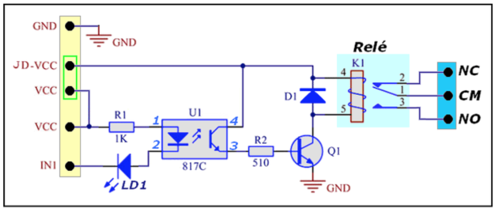

<td style="width: 20%;"></td>

<strong> Módulo Relé</strong>

<strong>Prof Epaminondas Lage</strong>

<a href="http://lattes.cnpq.br/7787341723868111"> Currículo Lattes LAGE, E. S.</a> 

# Índice 

* [Introdução](#Introdução)
* [Módulo relé](#Módulo-relé)
* [JD-VCC não conectado ao VCC](#JD-VCC-não-conectado-ao-VCC)
* [JD-VCC conectado ao VCC](#JD-VCC-conectado-ao-VCC)
* [Referências](#Referências)
* [Status do Projeto](#Status-do-Projeto)

# Introdução

Tipicamente, um relé de constituição muito básica apresenta uma bobina, um circuito magnético e alguns contatos: contato central, contato normalmente aberto e contato normalmente fechado. A figura 1 apresenta suas partes constituintes. No nosso Kit iremos operar com um módulo de 8 relés, o qual jé é construido para orerar em faixas de tensão e modos de operação que vamos descrever a seguir.

<table border="0">
<tbody>
<tr>
<td></td>
</tr>
<tr>
<td style="text-align: center;">Figura 1: Diagrama interno de um relé.</td>
</tr>
</tbody>
</table>
 

# Módulo relé

Na figura 2,  podemos observar que a sequência dos pinos no circuito de um módulo contendo apenas 1 relé.

<table border="0">
<tbody>
<tr>
<td></td>
</tr>
<tr>
<td style="text-align: center;">Figura 2: Diagrama elétrico do módulo.</td>
</tr>
</tbody>
</table>

Vamos considerar 2 cenários: um onde o "JD-VCC" não está conectado ao "VCC", e um onde o "JD-VCC" está conectado ao "VCC" (via "jumper" encaixado nos dois terminais no conector). Então segue:

# "JD-VCC" não conectado ao "VCC"

Se vc seguir o circuito iniciando pelo sinal "VCC", passando pelo Resistor R1, depois pelo LED interno do Opto-Acoplador (terminais 1 e 2 de U1), e finalmente pelo LED "LD1", então se chega ao sinal "IN1". 

Se vc ligar o sinal "VCC" ao 5V do Arduino, e o sinal "IN1" a um pino de saída do Arduino,  então tanto o LED do Opto-Acoplador, como o LED LD1 serão acionados quando se tem "LOW" no sinal "IN1",  e caso tenhamos "HIGH" em "IN1" então ambos os LEDs ficarão desacionados.  Assim dizemos que o acionamento é através do Nivel "LOW" (ou "0" ).

Agora considere ligar o sinal "VCC" a um pino de saída do Arduino,  e o sinal "IN1" ao  GND do Arduino (NÃO é o GND da plaquinha do Relé!!!).  Nesta condição, para que os LEDs sejam acionados,  é necessário que tenhamos "HIGH" na saída do Arduino,  e caso tenhamos "LOW" os LEDs estarão desacionados.

Podemos concluir que o sinal "VCC" é apenas o nome que deram ao sinal, mas de fato vc deve encará-lo apenas como o sinal que está ligado (via R1) ao "Anodo" do Opto-Acoplador (terminal 1 de U1).  Assim, para que os LEDs sejam acionados,  é preciso que este terminal tenha uma tensão elétrica positiva em relação ao sinal "IN1".  Logo, se vc fixa o sinal "VCC"  em 5V (do Arduino), então obrigatoriamente para acionar os LEDs,  "IN1" deverá ser "LOW".  Já se vc fixa o sinal "VCC" em 0V (o GND do Arduino), obrigatoriamente para acionar os LEDs "IN1" deverá ser "HIGH". Não tem outra forma.

Então observe, que vc pode escolher qual será o Nível Lógico ("LOW" ou "HIGH") que acionará o circuito, o que é portanto 100% flexível em relação a esta escolha do Nivel Lógico.  E claro:  o sinal "VCC" na plaquinha é apenas o nome que deram, e não significa que vc deve ligá-lo ao VCC do Arduino (5V) ou Ornage Pi (3,3V). Obviamente, a escolha do nome "VCC" para o sinal, não foi muito feliz.

Mas há ainda outra questão:  a isolação.  Observe que o "caminho" do circuito descrito acima, em nenhum momento entra em contato elétrico com os demais sinais do Circuito, ou melhor:  em nenhum momento aquele "caminho" entra em contato com o restante do Circuito que aciona diretamente a Bobina do Relé (R2, Q1, D1). Então dizemos que um circuito está isolado eletricamente do outro. Claro que existem distâncias físicas entre os componentes na plaquinha, e algumas são bem pequenas, talvez até menos de 1mm (isto irá variar de placa pra placa, já que existem muitos modelos no mercado).  Os circuitos estão efetivamente isolados, mas o quanto é "forte" esta isolação, vai depender destas distâncias. Por exemplo: se vc aplicar entre os dois circuitos (pode ser entre quaisquer dois pontos entre os dois) uma tensão de 1000V (mil Volts),  e a menor distância for de 1mm,  provavelmente a isolação irá aguentar, mas se vc aplicar 2500V então poderá começar a "pular" faíscas elétricas entre os dois pontos (da mesma forma que pulam na "cabeça" da vela em um motor de carro).  Este assunto é um tanto denso, e estou olhando pelo lado mais simples,  pois na prática, a isolação dependerá de diversas características, como o material existente entre os dois pontos (no exemplo são dois: o material da placa e o "Ar"), e ainda existem variações a considerar na medição das distâncias (chamadas de "clearance").

Mas o que interessa aqui é que nas condições descritas para as ligações, existe isolação entre os circuitos de acionamento dos LEDs, e o restante do circuito que aciona a Bobina do Relé (D1, Q1, R2,  e o transistor interno do Opto-Acoplador).

Claro, para que efetivamente o relé seja acionado (quando vc acionar os LEDs) ,  vc precisa aplicar uma tensão entre o sinal "JD-VCC"  e o sinal "GND", e esta tensão é a "nominal" para a Bobina do relé.  Ou seja, aplique a tensão entre "JD-VCC" e o "GND",  e controle o "ON/OFF" do relé através de um circuito isolado acionado pelo microcontrolador.

Logo, podemos completar a conclusão nesta "configuração":  podemos escolher o nivel lógico que acionará o relé, e ainda temos isolação elétrica entre o circuito do relé e o microcontrolador.  No entanto note que precisamos de uma fonte "separada" para alimentarmos a bobina do relé, e a tensão dessa Fonte será a mesma da bobina do relé, o que nos permite usar Relés com diferentes tensões da Bobina (sem estar limitado aà tensão do microcontrolador).

# "JD-VCC" conectado ao "VCC"

Podemos observar que já não temos mais a isolação elétrica entre os dois circuitos.  A tensão elétrica do sinal "VCC" será a mesma do sinal "JD-VCC".  Mas como vimos, para acionarmos a bobina do relé, a tensão em "JD-VCC" deve ser em relação ao sinal "GND" da plaquinha. Então por uma questão de simplificar o controle,  é conveniente que o sinal "GND" seja também conectado ao "GND" do microcontrolador, pois assim  tanto o "VCC" (que está agora ligado ao "JD-VCC") como o "IN1"  terão como referência uma mesma tensão (o GND do microcontrolador).  E se a bobina do relé for de 3,3V,  então parece conveniente também ligar o "VCC/JD-VCC" ao 3,3V do microcontrolador.  E por consequência, obrigatoriamente o "IN1" deverá ser "LOW" para acionar o Relé (como vimos no item "1"), e não há outra possibilidade, uma vez que o "VCC" está ligado ao "JD-VCC" e este último tem que ser a alimentação "positiva" para a Bobina do Relé.

Conclusão: além de perdermos a isolação entre os dois Circuitos (microcontrolador e acionamento da bobina do relé),  também não temos escolha em relação do nível lógico que liga o relé, que agora deve ser obrigatoriamente "LOW".  Nesssa conexão você não precisa de uma fonte "separada" para acionar a Bobina do relé,  pois está aproveitando o 3,3V do microcontrolador para fazer isso, mas claro que agora também terá obrigatoriamente que usar relés com bobina de 3,3V.

A corrente drenada pela bobina do relé,  será fornecida pelo microcongtrolador.  Para a maioria dos relés de 3,3V nas plaquinas,  essa corrente é tipicamente de 70mA,  ou seja: é significativa, e se você tem daqueles módulos com dois relés ou mais,  cada bobina irá puxar esta corrente da alimentação do microcontrolador.  Para um módulo com 8 Relés,  a corrente drenada será 8x70mA = 560mA.

Devido a essa corrente "alta" para módulos com vários Relés,  é comum que utilizar uma fonte  externa para o circuito dos relés. Essa fonte alimentará proverá a corrente necessária para as bobinas dos diversos relés no sistema. Mas existe um problema que precisa ser considerado:  não temos mais a isolação entre o microcontrolador e os circuitos da bobina do relé. Na maioria das vezes os skipes não chegam a serem fortes o suficiente para danificar os circuitos do microcontrolador,  mas são fortes o suficiente para alterar níveis lógicos "estáticos" nos pinos do microcontrolador.Acontecendo este fato é comum que os próprios pinos do microcontrolador que acionam os relés, mudem de estado, gerando acionamentos/desligamentos imprevistos dos relés. Inclusive se o "spike" ocorre em um relé, pode afetar qualquer outro pino do microcontrolador mesmo que este pino não seja usado para o controle de um relé.

## Referências

* https://labdegaragem.com/forum/topics/m-dulo-rel-8-canais-sem-jd-vcc-vcc-gnd
* https://blog.multcomercial.com.br/o-que-e-um-rele-quais-suas-funcoes-aplicacoes/
* https://www.filipeflop.com/blog/controle-modulo-rele-arduino/

# Status do Projeto

